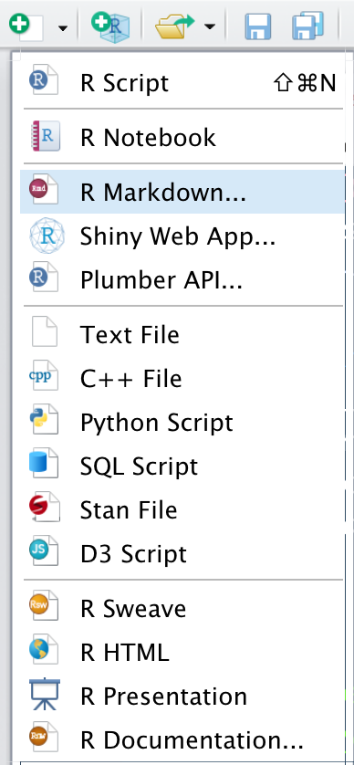
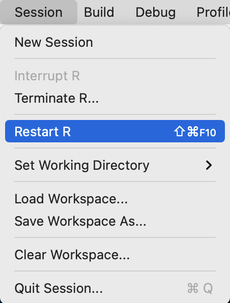
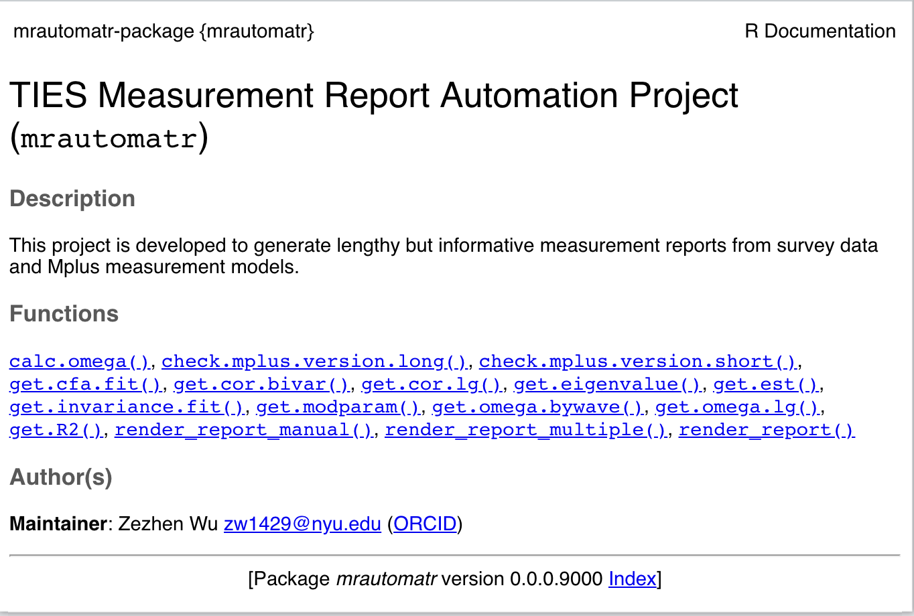

# Set up the package

## Install the necessary softwares

You need to set up R and Rstudio on your computer before everything. R is the programming language that powers this project, and Rstudio is the interface that allows you better interact with your R code. Please follow the steps below:

-   Download R [here](https://cran.r-project.org/mirrors.html) and install it before you install Rstudio.
-   Download Rstudio [here](https://rstudio.com/products/rstudio/download/#download) and install it.
-   Open Rstudio, and click the first icon from the left on the Rstudio toolbar, and select R Markdown. Rstudio will prompt you to install several packages, just follow the instructions and install them.

```{r, echo = F, out.width="66%", fig.align="center", dpi = 600}

```

## Download and install the `mrautomatr` package

-   Run the following lines:

```{=html}
<!-- -->
```
    install.packages("usethis")
    install.packages("devtools")
    library(usethis)
    library(devtools)

-   You will need to set up your GitHub Personal Auth Token because this package is still internal and private at this point. You may need to email Michael Wu ([zw1429\@nyu.edu](mailto:zw1429@nyu.edu){.email}) in order to gain access to the TIES github repository.

  - Essentially, You need to set up your personal access token in a file called `.Renviron`. After you install the `usethis` package, run `usethis::create_github_token()`.
  
  - It’ll take you through the process of creating a token, and then GitHub will give you a string of characters. **Copy that text to somewhere safe for now.**
  
  - Then, back in R, run `usethis::edit_r_environ()` and add this to the file: `GITHUB_PAT=[the token text here without the brackets]`. For example, `GITHUB_PAT=ghp_...`.

  - Save that file and restart your R session for changes to take effect.
  
```{r, echo = F, out.width="66%", fig.align="center", dpi = 600}

```
  
  - To verify that you got it to work, when R starts again, run `Sys.getenv("GITHUB_PAT")` and you should see your token, exactly how it was shown on GitHub. If you don’t, more troubleshooting is required and please email Michael.
  
-   Run the following line:

```{=html}
<!-- -->
```
    devtools::install_github("nyuglobalties/mrautomatr")
    library(mrautomatr)

-   Check out the functions by running `?function_name`, e.g.:

```{=html}
<!-- -->
```
    ?mrautomatr

You should be able to see the documentation page of `mrautomatr` in the Help panel.

```{r, echo = F, out.width="66%", fig.align="center", dpi = 600}

```
