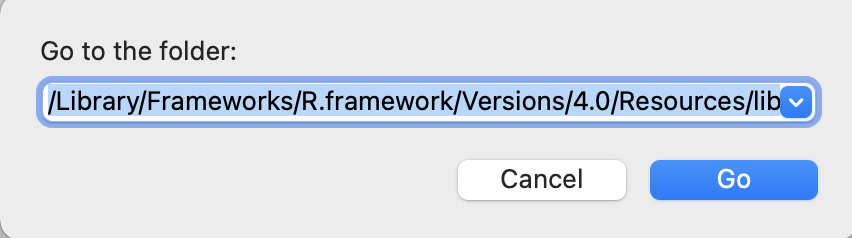

# Set up the parameters

## Organize your model outputs

Before you run any R code, you need to make sure that the parameters for the report are correctly specified.

First, copy and paste all **currently available** final Mplus models (only the `.out` files) into one folder (e.g., a folder called `Measurement report/Models` somewhere on Box). This includes:

-   EFA models
-   CFA models
-   Treatment invariance models
-   Age invariance models
-   Gender invariance models
-   Longitudinal invariance models

## A very important note on naming rules!!!

You need to name your file, items, and constructs properly in order for the wave tags shown properly in the document.

For file names, always have a wave tag right after your measure. For example, `CSRL1_cfa_1c_fsamp.out`, `RSQ2_CFA2-ie19.out`. If you only have one wave, use `1` as your wave tag.

For items and constructs (in your data, in Mplus files, and in the Excel sheet), **always add an underscore and a wave tag (\_\#)** in the subscale section to both the construct name and the item names in your excel sheet (e.g., `AANXDEP_1`, `PSRA_1`, `HAB_AB_2`).

These wave tags get picked up by `mrautomatr` to index the waves in plots and tables in your document.

## Fill in the Excel template

Second, fill in the Excel sheet template that we provide. You can find this template (`input_template.xlsx`) located in `inst/templates/` in the [package GitHub repository](https://github.com/nyuglobalties/mrautomatr/blob/master/inst/templates/input_template.xlsx). Simply hit `Download` to download the template and store somewhere in your computer.

Alternatively, this Excel file is downloaded along with the `mrautomatr` package. You can also find its file path on your computer by running `system.file("templates", "input_template.xlsx", package = "mrautomatr")` in R. Copy the file path. If you are a Mac user, go to your Finder and hit Go - Go to Folder in your toolbar, and paste the path there and hit Go. Then copy and paste the excel file somewhere in your computer (e.g., a folder called `Measurement report/template`).

```{r, echo = F, out.width="66%", fig.align="center", dpi = 600}


```

In this template, you need to manually type in the following parameters. For any of the files that are not available temporarily, you can leave blank and still be able to generate the report (with error messages shown in the Word document telling you that you need to specify more parameters/fix certain things to have a full report).

### Tab 1: `path`

A shorthand to get file path on Mac: go to the path/file and hit `command + option + C`.

If you are using Box, we recommend typing in an R function from `mrautomatr` -- `box_path("...")` in the `path` tab in the excel sheet. The `...` part is whatever sub-folders on your computer under the general Box folder. Examples are `box_path("Box 3EA Team Folder/Data Management")`, or `box_path("Peru/Data/Full")`. This is because different people can have different access to Box folders at different time (e.g. you only had access to `Data Management` in March, but gained access to `Box 3EA Team Folder` in April), and if you only specify the local path on your computer, you will need to re-specify it in the excel sheet whenever your level of access changes. `box_path(...)` prevents this from happening.

-   `year` indicates the study year.

-   `measure` indicates the measure name.

-   `data_file_path` should be wherever the final master data is located. It will be used to calculate summary statistics, bivariate correlations, and reliability statistics. Our tool currently takes the following data formats: `.csv`, `.xlsx`, `.dta`.

-   `fs_data_file_path` refers to the file path where the tabular data of the Mplus-generated factor scores is saved. Because Mplus **does not** generate a spreadsheet for you, you will need to:

    -   **(1) copy and paste the factor scores into an Excel sheet, and**

    -   **(2) insert the first row and name the variables exactly the same as they are in your master dataset and in your other Mplus models. Remember to add the \_\# wave tags.**

    -   **(3) save the sheet either as a .csv or an .xlsx file.**

-   `model_file_path` leads you to the folder where all the Mplus outputs are located.

### Tab 2: `subscale`

-   The first row should contain the subscale/factor names. They should be the same as the ones in your Mplus models.

-   For each subscale/factor, list the items. The rows can be of unequal length (i.e. you can leave blanks for subscales with smaller number of items).

-   These are specified to generate reliability estimates from the master dataset.

-   **Always** add an underscore and a wave tag (`_#`) in the `subscale` section to both the construct name and the item names in your excel sheet (e.g., `AANXDEP_1`). Whatever numbers comes after "\_" will be shown in the table as the wave tag. And the wave tag also needs to be added for the variables in the master dataset. Not sure if this is easy to do in Mplus, but you can certainly export another master dataset after running things like `names(dat)[1:10] <- paste(names(dat)[1:10], "_1", sep = "")` on the variables you want to modify.

The Omega reliability coefficients will likely not show up if the wave tags are misspecified. If you have already run quite many models and generated multiple reports, I'd suggest using the `get.omega.bywave()` in the`mrautomatr` and manually fill in the omegas in your document. E.g.:

    get.omega.bywave(model = "xxx.out", 
                     path = "/Users/xxx")

### Tab 3: `model`

-   This specifies all necessary Mplus model names (i.e. `xxx.out`).

-   List all available models in the order of waves (e.g. wave 1 before wave 2).

-   There is no restrictions on the file names, but please follow the [naming rules](https://nyu.box.com/s/ate5l7wmw164u7xjg3g8x1vrfhwnt0ax) for reproducibility purposes.

### Tab 4: `description`

-   This is specified to have a description of the items at the beginning of the report.

-   You can format this tab in any ways that you like, but the caveat is that (1) the first row will be taken as the header and set to bold, and (2) you cannot merge cells.

## Summary

+---------------------+------------------------------------------------------------------+
| Variable name       | Description                                                      |
+:====================+:=================================================================+
| `year`              | Study site and year                                              |
+---------------------+------------------------------------------------------------------+
| `measure`           | Measure name                                                     |
+---------------------+------------------------------------------------------------------+
| `data_file_path`    | Local file path to the master dataset on your own computer       |
+---------------------+------------------------------------------------------------------+
| `fs_data_file_path` | Local file path to the factor score dataset on your own computer |
+---------------------+------------------------------------------------------------------+
| `model_file_path`   | Local file path to all the Mplus .out files                      |
+---------------------+------------------------------------------------------------------+
| `subscale`          | Subscales and their corresponding items                          |
+---------------------+------------------------------------------------------------------+
| `model_efa`         | EFA models                                                       |
+---------------------+------------------------------------------------------------------+
| `model_cfa`         | CFA models                                                       |
+---------------------+------------------------------------------------------------------+
| `model_inv_tx`      | Treatment invariance models                                      |
+---------------------+------------------------------------------------------------------+
| `model_inv_gender`  | Gender invariance models                                         |
+---------------------+------------------------------------------------------------------+
| `model_inv_age`     | Age invariance models                                            |
+---------------------+------------------------------------------------------------------+
| `model_inv_lg`      | Longitudinal invariance model                                    |
+---------------------+------------------------------------------------------------------+
| `description`       | Detailed item descriptions                                       |
+---------------------+------------------------------------------------------------------+
