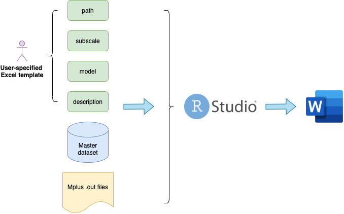

# Project overview

This project is developed to generate lengthy but informative measurement reports from survey data and Mplus measurement model outputs for projects at [NYU Global TIES for Children](https://steinhardt.nyu.edu/ihdsc/global-ties).

Typically, a research institute like TIES has the obligation to generate detailed measurement reports to better inform the funders and the cooperating agencies about its most up-to-date work. However, even with a Word template, the process from analytical results to a publishable report is [**unnecessarily inefficent and prone to mistakes**]{.ul} even for the most careful research assistant.

Therefore, we develop an R package called [`mrautomatr`](https://github.com/nyuglobalties/mrautomatr) to be used in conjunction with Rstudio to address this issue. Currently, the project only suits the need of NYU Global TIES, where we can impose [naming rules](https://nyu.box.com/s/ate5l7wmw164u7xjg3g8x1vrfhwnt0ax) for files and variables and most people use Mplus for measurement modeling and STATA for other analyses. Future adaptations are needed as people move their analysis to R.

The project workflow is shown below: the users specify parameters in a Microsoft excel sheet and move several files to a destined folder, run a command in R, and (**boom!**) there is a well-formatted measurement report in Microsoft Word (powered by the [`flextable`](https://davidgohel.github.io/flextable/) & [`rmarkdown`](https://bookdown.org/yihui/rmarkdown/) R packages).

```{r, echo = F, out.width="66%", fig.align="center", dpi = 600}

```


We chose Word over LaTex (which generates pdf files) and html (which generates web pages) simply to minimize the confusion around writing codes in R, which takes a long time to learn. After generating the reproducible parts of the report, feel free to rename it and manually edit the sections that are text-heavy.

Check out the [TIES R workshop series](https://github.com/nyuglobalties/workshops) and Yihui Xie's [Rmarkdown book](https://bookdown.org/yihui/rmarkdown/) if you'd like to learn some necessary tools to customize your reporting formats using R.
